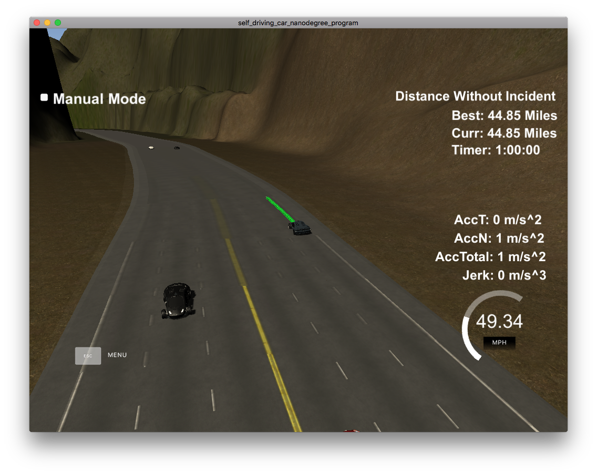

# CarND-Path-Planning-Project
Self-Driving Car Engineer Nanodegree Program

## Model Documentation

### Abstraction

This model is programmed to achieve smoothly keep or change lane with avoiding collision or slow traffics.

In my environment, this model can drive for more than one hour without any accidents while keeping top speed almost always (average speed then was 44.85 mph.) and this result exceeds the criterior by far.

In this model,
there are mainly 5 stages where you can find around main.cpp:93.
The short description of each stages are blow and detailed one will be later described.

- ProcessSensorFusion
This stage calculates variables for speed and path planner.

- DecideTargetLane
This stage decides which lane will be the best to go based on the result of ProcessSensorFusion.

- PlanPath
This stage makes a spline of path which smoothly guides the vehicle to target lane which is determined by DecideTargetLane

- PlanSpeed
This stage makes a spline of speed to decrease speed if there is a chance of collision and increase if not based on the result of ProcessSensorFusion.

- GeneratePath
This stage finally generates actually path plan based on splines of path and speed which are calculated in PlanPath and PlanSpeed.

### Detailed description of each stage

#### ProcessSensorFusion

This stage is described in PathPlanner::processSensorFusion() which is written in path_planner.cpp:215.

This stage process sensor_fusion data and calculated out following variables which will be used in later stages.

- min_time_to_collision

This will be later used in PlanSpeed stage to avoid collision.
The values indicates in how many seconds the vehicle will collide to a anterior obstacle.

- min_distance_to_obstacle

This will be later used in PlanSpeed stage to keep appropriate space between vehicles.
The value indicates how much space left in front of the vehicle.

- ttc_left/current/right_lane

Those will be later used in DecideTargetLane stage to avoid lane in which the vehicles need to decelerate.
Those values will be calculated in each lane depending on which lane the obstacles exist.

- clear_distance_left/current/right_lane

Those will be later used in DecideTargetLane stage to prior lane with fewer vehicle ahead.
Those values will be calculated in each lane depending on which lane the obstacles exist.

- do_not_go_left/right

These flags indicates that there is a obstacle just in left/right side of the vehicle.
These will later be used in DecideTargetLane stage to avoid dangerous lane changes.

#### DecideTargetLane

This stage picks which lane will be the best to go. The code is available at path_planner.cpp:274.

While the vehicle is keeping lane,
this function calculates the cost to keeping lane or change to left/right lane.

The cost is determined by time_to_collision, clear_distance, speed and do_not_go_* flags.

Usually, just keeping lane is prioritized but if there are fewer obstacles or faster speed in left/right lane, changing lane to left/right will be decided.

This cost function also prioritize going center lane because being in the center has more options of behavior. (path_planner.cpp:306)

There are also some conditions which forbids lane changing evenwhen cost of lane change is lower than cost of keeping lane that are controlled by do_not_* flags.
The first condition is the vehicle is already running the most left/right lane and there is no lane to further go.
The second condition is there is a obstable just left/right of the vehicle and it is too dangerous to further go.
The third reason is it does not take enough time after last lane change is performed so as to avoid frequent lane changes. This is controlled by PathPlanner::kMinimumKeepLaneCount which is set 5 seconds.
Even while lane changing, the behavior cancels if do_not_* flag enabled.

#### PlanPath

This stage calculate a spline of path which will later used in GeneratePath stage.

The first two points are usually inherited from the points of the previous cycle to achieve smooth transition. If no points are available from the previous cycle, those will be decided from the current position and velocity.

Then the target points are decided according to the target lane which is calculated in DecideTargetLane stage.

The spline is stored in PathPlanner::spline_path.

#### PlanSpeed

This stage calculate a spline of speed which will later used in GeneratePath stage.

The main variable of this stage is PathPlanner::target_speed.

This function increase or decrease target_speed depending on PathPlanner::min_time_to_collision or PathPlanner::min_distance_to_obstacle.

The spline is calculated to smoothly achieve target_speed in 125 frames.

#### GeneratePath

This stage finally generate actual path based on the splines of PlanPath and PlanSpeed.